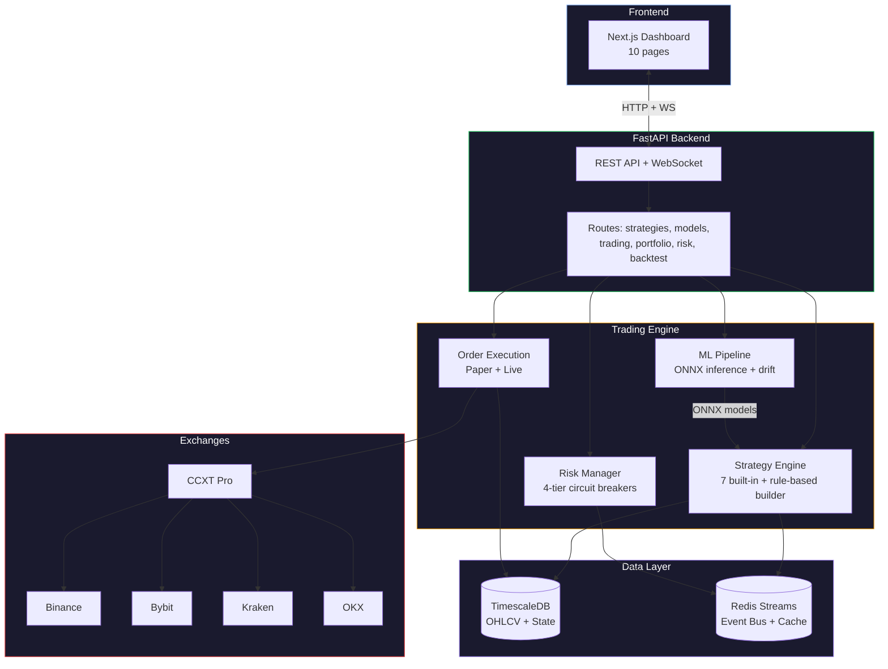
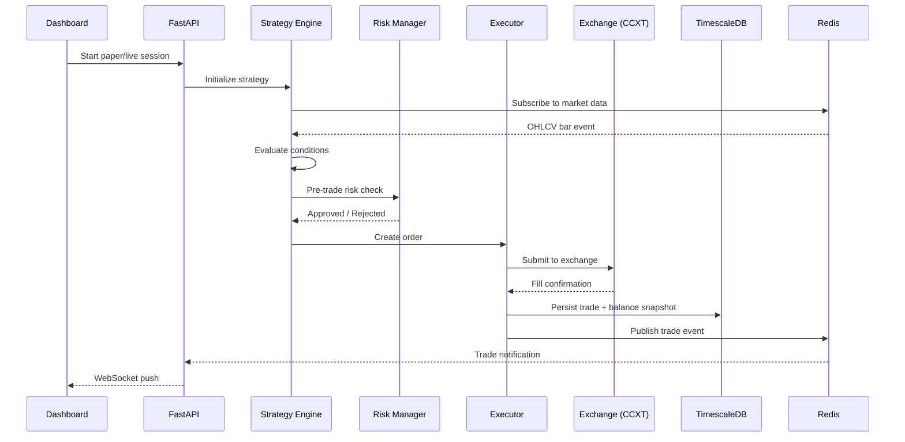
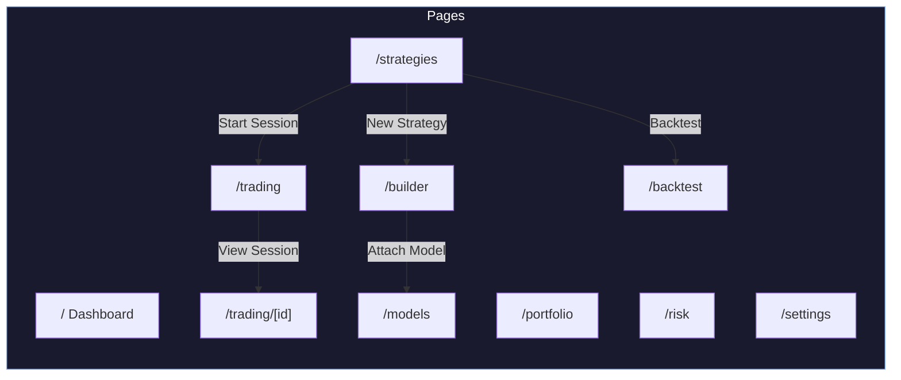
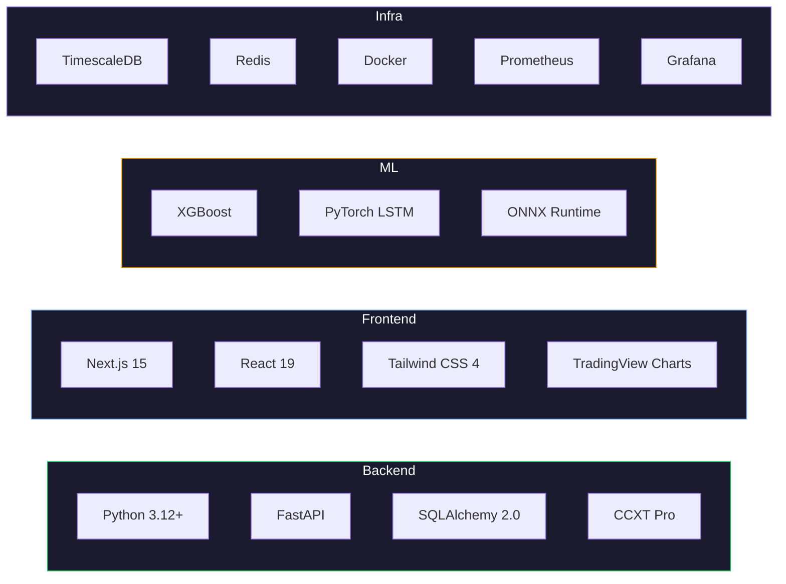
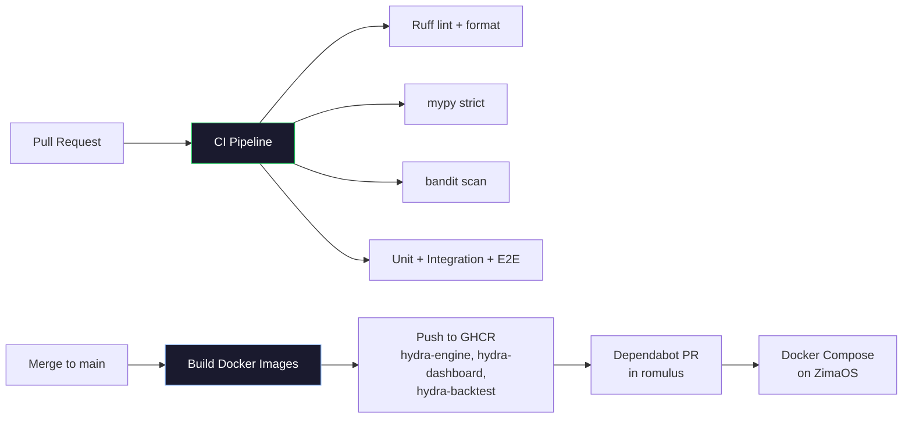

# Hydra

Bitcoin auto-trading platform with ML-assisted signals, multi-exchange support, backtesting with walk-forward/CPCV, and production monitoring.

## Features

- **Multi-exchange**: Binance, Bybit, Kraken, OKX (Spot + Futures) via CCXT
- **Strategy framework**: Visual no-code builder + Python strategies, hot-reload, 7 built-in strategies, 19 configs
- **Backtesting**: Walk-forward analysis, CPCV, VectorBT parameter sweeps, realistic fill simulation
- **ML pipeline**: XGBoost/LSTM training, ONNX inference with upload/promote/rollback, drift detection, ML overlay per strategy
- **Risk management**: 4-tier circuit breakers, pre-trade checks, per-strategy risk overrides, exchange-side safety orders, kill switch
- **Paper trading**: Per-strategy capital allocation, real PnL tracking (unrealized + realized), session detail with PnL %
- **Dashboard**: Next.js frontend with real-time WebSocket updates, TradingView charts, 10 pages
- **Monitoring**: Prometheus metrics, Grafana dashboards (Sharpe, drawdown, PnL), Telegram alerts

## Architecture



### Data Flow



## Dashboard Pages



| Page | Description |
|------|-------------|
| `/` | Portfolio value, daily PnL chart, balance history, active positions |
| `/strategies` | Strategy cards with performance, per-strategy capital, start/stop sessions, risk overrides |
| `/builder` | Visual rule builder with indicators, conditions, timeframes, risk config, ML overlay |
| `/trading` | Live TradingView chart, open positions, recent trades, risk controls, kill switch |
| `/trading/[id]` | Session detail with starting capital, PnL %, positions, trade history, WebSocket live updates |
| `/backtest` | Run backtests with walk-forward/CPCV, equity curves, trade analysis |
| `/models` | ML model registry with ONNX upload, promote/rollback, accuracy chart, drift monitoring |
| `/portfolio` | Detailed position breakdown, allocation chart, balance snapshots |
| `/risk` | Circuit breaker status, risk limits, daily PnL vs limits |
| `/settings` | System config, exchange credentials, trading mode |

## Project Structure

```
src/hydra/
├── core/           # Config, models, event bus, shared types
├── data/           # Market data ingestion (CCXT, WebSocket)
├── indicators/     # Technical indicators (TA-Lib + custom)
├── strategy/       # Strategy framework, rule-based builder, 7 built-in strategies
│   └── builtin/    # breakout, composite, mean_reversion, ml_ensemble,
│                   # momentum, rule_based, trend_following
├── ml/             # Training, ONNX serving, drift detection, feature engineering
├── backtest/       # Backtesting engine (walk-forward, CPCV)
├── execution/      # Paper trading, live execution, session manager
├── risk/           # Circuit breakers, pre-trade checks, position sizing, exchange safety
├── portfolio/      # Position tracking + PnL calculation
├── dashboard/      # FastAPI routes + WebSocket handlers
│   └── routes/     # strategies, models, trading, portfolio, risk, backtest, system
└── ops/            # Health checks, Prometheus metrics, Telegram alerts
dashboard/          # Next.js 15 frontend (React 19, Tailwind CSS 4, Recharts)
docker/             # Dockerfiles (engine, dashboard, backtest, ml)
config/             # YAML configs (base, live, backtest, 19 strategy configs)
tests/              # Unit (849+), integration, e2e, performance
```

## Tech Stack



## Quick Start

```bash
# Install dependencies (requires Python 3.12+ and uv)
make dev

# Start local TimescaleDB + Redis
make dev-up

# Run all checks (lint + type-check + security + tests)
make check
```

## Development

```bash
make install       # Install dependencies
make dev           # Install with all extras (dev + ml-training)
make test          # Run unit tests with coverage
make unit          # Unit tests only
make integration   # Integration tests only
make e2e           # End-to-end tests
make perf          # Performance benchmarks
make lint          # Ruff check + format check
make format        # Auto-format code
make type-check    # mypy strict mode
make security      # bandit security scan
make imports       # Import boundary checks
make check         # All: lint + type-check + security + test
make dev-up        # Start local TimescaleDB + Redis
make dev-down      # Stop local infrastructure
make docker-build  # Build all Docker images
make clean         # Remove build artifacts
```

## CI/CD



- PRs trigger lint, type-check, security scan, unit/integration/e2e tests
- Merge to `main` builds Docker images, pushes to GHCR with auto-incrementing semver tags
- Deployed via [romulus](https://github.com/somatczk/romulus) as a Docker Compose stack on ZimaOS

## License

MIT
